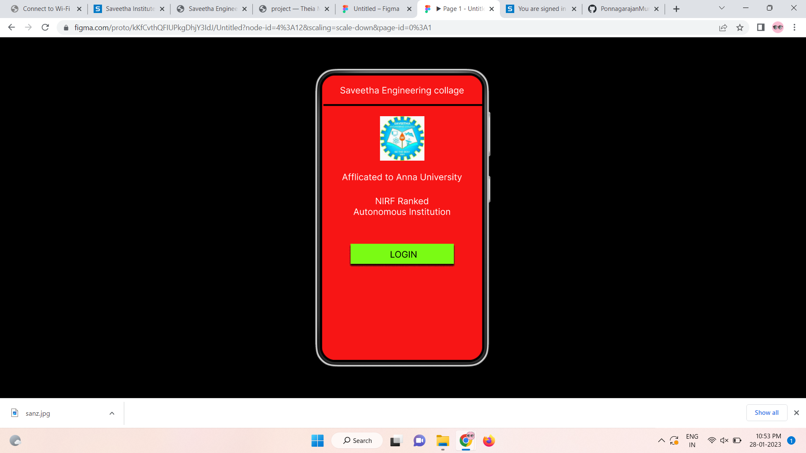
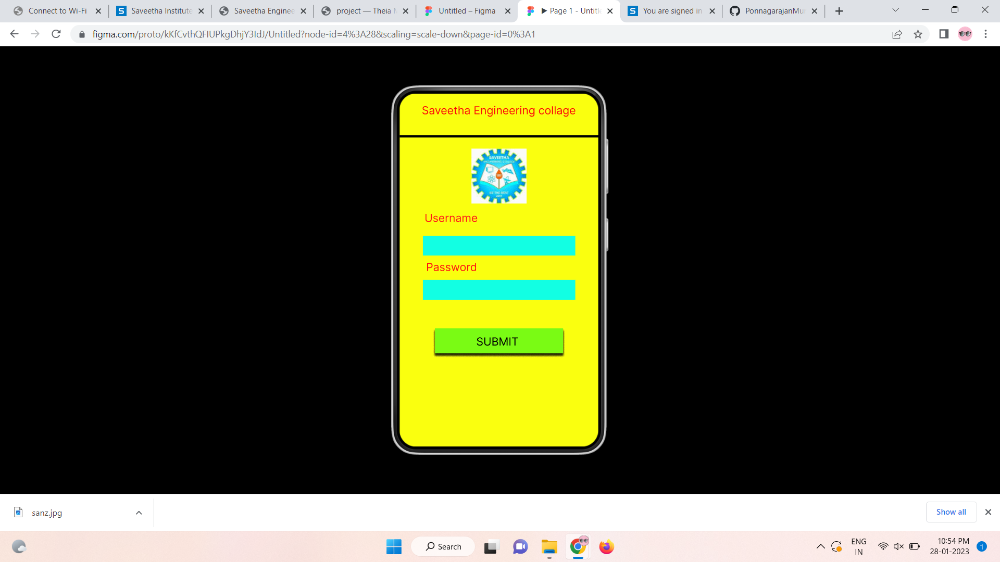
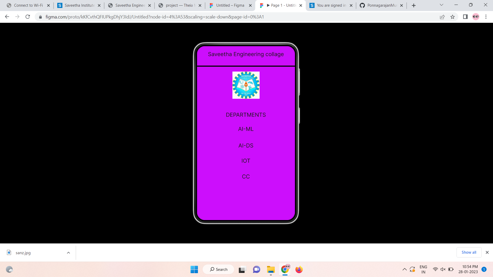

# Event Registration Web Application

## AIM:
To design, develop and deploy a web application for event registration.

## DESIGN STEPS:

### Step 1:
Create a new frame.

### Step 2:
Select any one preset size of your choice.

### Step 3:
Select the shapes you need.

### Step 4:
Import images as needed.

### Step 5:
Create pages based on your need and link them.

### Step 6:

Validate the HTML and CSS code.

### Step 6:

Publish the website in the given URL.

## DESIGN TOOL:
Figma

## code:
```
/* Home Page */
position: relative;
width: 360px;
height: 640px;
background: #F71515;

/* Login Page */
position: relative;
width: 360px;
height: 640px;
background: #FAFF0F;

/* Saveetha Engineering collage */
position: absolute;
width: 331px;
height: 29px;
left: 14px;
top: 18px;
font-family: 'Inter';
font-style: normal;
font-weight: 400;
font-size: 20px;
line-height: 24px;
text-align: center;
color: #191717;

/* DEPARTMENTS */
position: absolute;
width: 331px;
height: 29px;
left: 14px;
top: 241px;
font-family: 'Inter';
font-style: normal;
font-weight: 400;
font-size: 20px;
line-height: 24px;
text-align: center;
color: #191717;

/* AI-ML */
position: absolute;
width: 331px;
height: 29px;
left: 14px;
top: 293px;
font-family: 'Inter';
font-style: normal;
font-weight: 400;
font-size: 20px;
line-height: 24px;
text-align: center;
color: #191717;

/* AI-DS */
position: absolute;
width: 331px;
height: 29px;
left: 14px;
top: 354px;
font-family: 'Inter';
font-style: normal;
font-weight: 400;
font-size: 20px;
line-height: 24px;
text-align: center;
color: #191717;

/* IOT */
position: absolute;
width: 331px;
height: 29px;
left: 14px;
top: 410px;
font-family: 'Inter';
font-style: normal;
font-weight: 400;
font-size: 20px;
line-height: 24px;
text-align: center;
color: #191717;

/* CC */
position: absolute;
width: 331px;
height: 29px;
left: 14px;
top: 468px;
font-family: 'Inter';
font-style: normal;
font-weight: 400;
font-size: 20px;
line-height: 24px;
text-align: center;
color: #191717;

/* Line 2 */
position: absolute;
width: 360px;
height: 0px;
left: 0px;
top: 76px;
border: 4px solid #000000;

/* Logo */
position: absolute;
width: 100px;
height: 100px;
left: 130px;
top: 94px;
background: url(sanz.jpg);
```
## OUTPUT:




## RESULT:
The program to design, develop and deploy a web application for event registration is completed successfully.